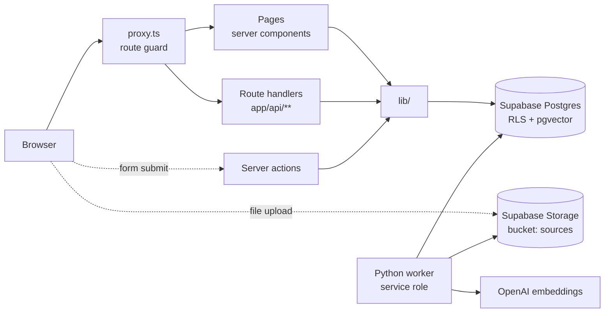
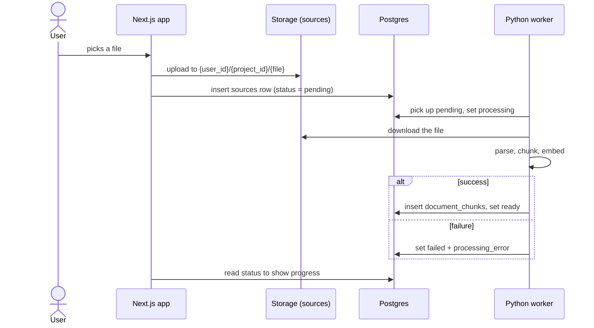
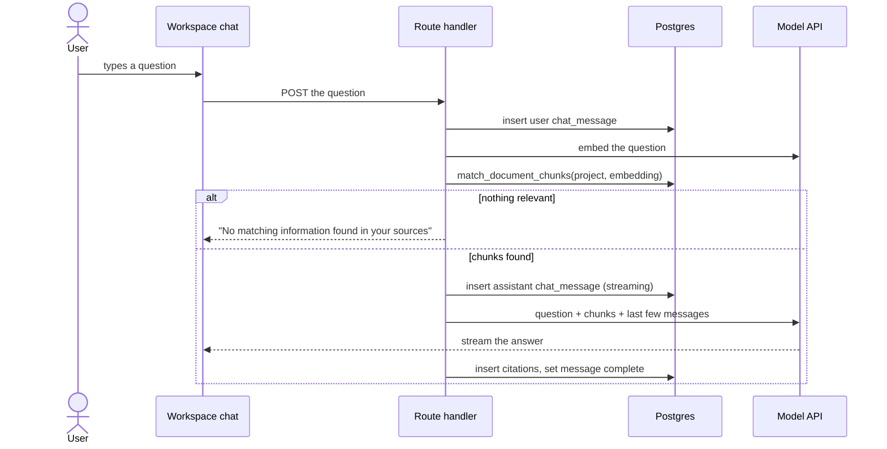

# Architecture

How the app is actually built: which piece handles which job, and how a request moves
through it. For the tables themselves, see [data-model.md](data-model.md).

## No controller layer

The original spec modelled the system as entity, boundary, and controller objects
(`AuthController`, `ProjectController`, …). **We don't build those classes.** In a
Next.js + Supabase app, their jobs are already split between the framework, Supabase,
and a few thin files:

| Spec idea  | What does that job here                                                                                                        |
| ---------- | ------------------------------------------------------------------------------------------------------------------------------ |
| Boundary   | A route (`app/**/page.tsx`) and its components (`components/`)                                                                 |
| Controller | A **route handler** (`app/api/**/route.ts`) or **server action** (`actions.ts`): check sign-in, validate with zod, call `lib/` |
| Logic      | A plain function in `lib/` (e.g. `lib/projects.ts`) that takes a Supabase client                                               |
| Security   | **Row-level security** in Postgres, plus the route guard in `proxy.ts`                                                         |
| Identity   | **Supabase Auth** — users, sessions, tokens, emails                                                                            |
| Entity     | A Postgres table in `supabase/migrations/`, typed by `lib/supabase/database.types.ts`                                          |

Where each kind of file goes: [01-project-structure](../rules/01-project-structure.md).

## The pieces

| Piece          | Where                                                  | Does                                                                                                                      |
| -------------- | ------------------------------------------------------ | ------------------------------------------------------------------------------------------------------------------------- |
| Route guard    | `proxy.ts` → `lib/supabase/proxy.ts`                   | Refreshes the session cookie. Signed out: pages redirect to `/login`, `/api/*` answers 401. Public paths are listed there |
| Pages          | `app/**/page.tsx`                                      | Server components. Read data on the server through `lib/`                                                                 |
| Route handlers | `app/api/**/route.ts`                                  | The REST API. Check sign-in → zod → `lib/` → `Response.json`                                                              |
| Server actions | `app/**/actions.ts`                                    | The app's own forms (sign-in, create project, remove source). Same three steps as a route handler                         |
| `lib/`         | `lib/projects.ts`, `lib/sources.ts`, `lib/supabase/*`  | Queries. Maps snake_case rows to camelCase domain types. Returns `{ ok, … }` results, never throws for expected failures  |
| Supabase Auth  | hosted                                                 | Sign-in codes, sessions (a cookie pair), JWTs, the `auth.users` table                                                     |
| Postgres + RLS | `supabase/migrations/`                                 | All data. RLS limits every query to the signed-in user's projects. Deletes cascade                                        |
| pgvector       | `document_chunks.embedding`, `match_document_chunks()` | Semantic search, filtered to one project                                                                                  |
| Storage        | bucket `sources`                                       | Uploaded files at `{user_id}/{project_id}/{file}`. Storage policies allow only your own folder                            |
| Worker         | separate Python service (CECS491-11/12) — not built    | Parses, chunks, and embeds sources. Uses the service role, so it bypasses RLS                                             |

### Two rules every backend change follows

1. **Run queries as the user.** Use `createClient()` from `lib/supabase/server.ts`, never
   the service role, so RLS applies. Another user's row then reads as "not found" — no
   ownership check needed in code
2. **Check sign-in and validate, even behind the guard.** The proxy already blocks
   signed-out requests, but each route handler and server action calls
   `getSupabaseUser()` and re-validates input with zod. Server actions are public
   endpoints

## Who handles each job

What became of every controller in the spec. **Dropped** means there is nothing to
build — something else already does it.

### Identity and security — handled by Supabase and Postgres

| Spec controller    | Now                                                                                                                                                                                                                 | Status    |
| ------------------ | ------------------------------------------------------------------------------------------------------------------------------------------------------------------------------------------------------------------- | --------- |
| AuthController     | **Dropped.** Supabase Auth: `signInWithOtp` / `verifyOtp` / `signOut` in `app/login/actions.ts`. Sessions and JWTs are Supabase's; read with `getClaims()`                                                          | Built     |
| OAuthController    | **Dropped.** Supabase's Google provider: `signInWithOAuth`, plus one callback route that calls `exchangeCodeForSession`                                                                                             | Not built |
| UserController     | **Mostly dropped.** Email change is Supabase's `updateUser` (it emails a confirmation). Account deletion needs one server-side call with the service role (`auth.admin.deleteUser`); the database cascades the rest | Not built |
| SecurityController | **Dropped.** RLS on every table and the storage bucket, `proxy.ts` for routes, zod for input, Next.js origin check on server actions                                                                                | Built     |

### Projects and sources — thin routes over `lib/`

| Spec controller         | Now                                                                                                                                               | Status       |
| ----------------------- | ------------------------------------------------------------------------------------------------------------------------------------------------- | ------------ |
| ProjectController       | `lib/projects.ts`, exposed by `app/api/projects/**` and the `createProject` server action                                                         | Built        |
| SourceController        | `lib/sources.ts` in the same shape. List (sources page) and delete (row, then Storage file, via `removeSource`) are built. Insert, rename to come | Partly built |
| UploadController        | **Mostly dropped.** The bucket enforces type (PDF, text, Markdown) and size (50 MiB). The app uploads to Storage, then inserts the `sources` row  | Not built    |
| LinkIngestionController | Link sources — websites, YouTube                                                                                                                  | Stretch goal |

### Processing — the worker

| Spec controller         | Now                                                                                        | Status    |
| ----------------------- | ------------------------------------------------------------------------------------------ | --------- |
| ProcessingJobController | **Dropped.** `sources.status` is the queue: `pending → processing → ready \| failed`       | Schema    |
| ParsingController       | Worker step. Writes extracted details to `sources.metadata`                                | Not built |
| ChunkingController      | Worker step. Writes `document_chunks` with `chunk_index` and `page_number`                 | Not built |
| IndexingController      | **Mostly dropped.** Worker writes the embedding; the HNSW index in Postgres updates itself | Not built |

### AI — route handler + `lib/`

| Spec controller              | Now                                                                                                                    | Status       |
| ---------------------------- | ---------------------------------------------------------------------------------------------------------------------- | ------------ |
| RetrievalController          | **Mostly dropped.** `match_document_chunks(project_id, query_embedding)` in Postgres. Runs as the user, so RLS applies | Schema       |
| AIController                 | A `lib/` module that builds the prompt and calls the model. Keep the provider behind one function so it can be swapped | Not built    |
| ChatController               | A route handler that streams the answer and writes `chat_messages`                                                     | Not built    |
| CitationController           | Insert `citations` rows for the chunks the answer used. RLS rejects a chunk from another user's project                | Not built    |
| Summary, Comparison, Insight | Same pattern as chat                                                                                                   | Stretch goal |
| NotificationController       | **Dropped.** No use case needs it. Processing progress shows through `sources.status`                                  | —            |

## Screens and routes

| Screen                | Route                                         | Use cases     | Status      |
| --------------------- | --------------------------------------------- | ------------- | ----------- |
| Landing page          | `/home` (`/` redirects by sign-in state)      | —             | Built       |
| Sign in (and sign up) | `/login` — one form: email, then 6-digit code | UC-01, UC-03  | Built       |
| Dashboard             | `/dashboard`                                  | UC-09         | Built       |
| New project           | `/projects/new`                               | UC-07         | Built       |
| Workspace             | `/projects/[projectId]` — sources + chat      | UC-09, UC-16  | Page exists |
| Sources               | `/projects/[projectId]/sources`               | UC-11 – UC-14 | Page exists |
| Summaries             | `/projects/[projectId]/summaries`             | UC-17         | Placeholder |
| Analysis              | `/projects/[projectId]/analysis`              | UC-18, UC-19  | Placeholder |
| Settings              | `/settings`                                   | UC-04 – UC-06 | Page exists |
| Edit project          | —                                             | UC-08         | API only    |
| Citation viewer       | —                                             | UC-20         | Not built   |

## How a source gets processed (UC-11, UC-15)

How the worker finds new rows (polling, a database webhook, …) is not decided yet.

## How a question gets answered (UC-16)

The shape the schema is built for. None of this runs yet.

Retrieval sends the model the matching chunks and the last few messages — never the
whole chat history.
