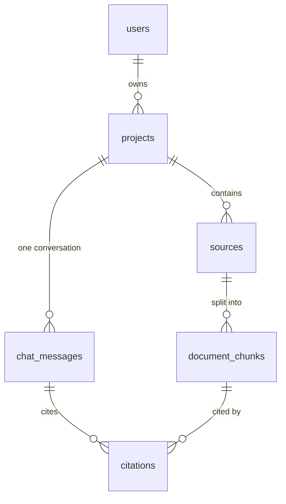

# Data model

The data the app stores, as built in `supabase/migrations/`. The migration is the source
of truth. This page explains it and records what the spec asked for on top. For how
requests reach this data, see [architecture.md](architecture.md). For the words, see
`CONTEXT.md`.

## Overview

| Table                    | Holds                                                    | Written by                |
| ------------------------ | -------------------------------------------------------- | ------------------------- |
| `auth.users`             | Everyone who has signed in. Owned by Supabase Auth       | Supabase                  |
| `public.projects`        | A user's research projects                               | The user                  |
| `public.sources`         | Uploaded files in a project, and their processing status | User adds; worker updates |
| `public.document_chunks` | Passages of a source's text, with embeddings             | Worker only               |
| `public.chat_messages`   | The project's single conversation                        | The user (via the app)    |
| `public.citations`       | Links from an answer to the chunks behind it             | The user (via the app)    |
| Storage bucket `sources` | The uploaded files themselves                            | The user                  |

"The user" means the app, running queries as the signed-in user, so RLS applies. The
worker uses the service role and bypasses RLS.

## The rules the schema enforces

- **One owner.** Every row hangs off a project, and a project off one user. RLS on every
  table limits reads and writes to your own projects. Another user's row reads as "not
  found"
- **Citations can't cross users.** A citation insert must name your own message **and**
  your own chunk
- **Deletes cascade.** User → projects → sources → chunks → citations, and project →
  messages → citations. Deleting a source removes it from every answer
- **Storage does not cascade.** Deleting a row leaves its file in the bucket. The app
  must delete the file through the Storage API
- **Users can't fake processing.** Users can insert a source (`project_id`, `kind`,
  `title`, `storage_path`) and rename it. Only the worker sets `status`,
  `processing_error`, `metadata`, and writes chunks

## Tables

### Users — `auth.users`

Supabase's table. No app-side users table yet; `claims.sub` from `getClaims()` is the
user id. Supabase handles sign-in codes, sessions, tokens, email change, and a Google
provider when we turn it on.

### `projects`

| Column        | Type        | Notes                                             |
| ------------- | ----------- | ------------------------------------------------- |
| `id`          | uuid        |                                                   |
| `user_id`     | uuid        | Defaults to `auth.uid()` — the app never sends it |
| `title`       | text        | 1–100 characters after trimming                   |
| `description` | text, null  | Blank is stored as `null`, never `''`             |
| `created_at`  | timestamptz |                                                   |
| `updated_at`  | timestamptz | Set by a trigger on every update                  |

Code: `lib/projects.ts` (list, get, create, update, delete). API: `/api/projects`,
`/api/projects/[projectId]`.

### `sources`

| Column             | Type        | Notes                                                              |
| ------------------ | ----------- | ------------------------------------------------------------------ |
| `id`               | uuid        |                                                                    |
| `project_id`       | uuid        |                                                                    |
| `kind`             | text        | `pdf` \| `text`. Links are a stretch goal                          |
| `title`            | text        | 1–200 characters. The only column a user can change                |
| `storage_path`     | text        | `{user_id}/{project_id}/{file}` in the `sources` bucket. Unique    |
| `status`           | text        | `pending` → `processing` → `ready` \| `failed`. The worker's queue |
| `processing_error` | text, null  | Why it failed                                                      |
| `metadata`         | jsonb       | Whatever the parser finds: author, page count, …                   |
| `created_at`       | timestamptz |                                                                    |

The bucket accepts PDF, plain text, and Markdown up to 50 MiB.

### `document_chunks`

| Column        | Type          | Notes                                                                                   |
| ------------- | ------------- | --------------------------------------------------------------------------------------- |
| `id`          | uuid          |                                                                                         |
| `source_id`   | uuid          |                                                                                         |
| `project_id`  | uuid          | Copied from the source so search needs no join. Kept in sync by a composite foreign key |
| `chunk_index` | integer       | Order within the source. Unique per source                                              |
| `content`     | text          |                                                                                         |
| `page_number` | integer, null | For citations                                                                           |
| `embedding`   | vector(1536)  | OpenAI `text-embedding-3-small`. Null until embedded                                    |
| `created_at`  | timestamptz   |                                                                                         |

Search: `match_document_chunks(project_id, query_embedding, match_count = 8)` returns the
nearest chunks in one project with a `similarity` score. It runs as the caller, so RLS
applies. The query must be embedded with the same model.

### `chat_messages`

| Column       | Type        | Notes                                                     |
| ------------ | ----------- | --------------------------------------------------------- |
| `id`         | uuid        |                                                           |
| `project_id` | uuid        | One running conversation per project                      |
| `role`       | text        | `user` \| `assistant`                                     |
| `content`    | text        |                                                           |
| `status`     | text        | `streaming` \| `complete` \| `failed`. Default `complete` |
| `created_at` | timestamptz |                                                           |

### `citations`

| Column        | Type        | Notes                                              |
| ------------- | ----------- | -------------------------------------------------- |
| `id`          | uuid        |                                                    |
| `message_id`  | uuid        | The assistant message                              |
| `chunk_id`    | uuid        | The supporting chunk. It gives the source and page |
| `anchor_text` | text, null  | The quoted passage, when the model quotes one      |
| `created_at`  | timestamptz |                                                    |

## Spec operations → how they happen

The spec listed methods on each entity. Most are one Supabase call; none needs its own
class.

| Spec method                                   | Here                                                                 |
| --------------------------------------------- | -------------------------------------------------------------------- |
| `CreateAccount`, `Login`, `CreateSession`     | `signInWithOtp` + `verifyOtp` — first sign-in creates the user       |
| `ValidateSession`                             | `getClaims()` — verifies the JWT                                     |
| `TerminateSession`                            | `signOut()`                                                          |
| `UpdateAccount`                               | `updateUser({ email })` — Supabase emails a confirmation             |
| `RequestAccountDeletion`                      | `auth.admin.deleteUser` (service role) — the database cascades       |
| `CreateProject` … `DeleteProject`             | `lib/projects.ts`                                                    |
| `AddUploadedSource`                           | Storage upload, then insert a `sources` row                          |
| `UpdateSourceStatus`                          | Worker updates `status`                                              |
| `RemoveSource`                                | Delete the row (chunks and citations cascade), then the file         |
| `CreateMetadata`, `ExtractMetadata`           | Worker fills `sources.metadata`                                      |
| `CreateChunk`, `IndexChunk`                   | Worker inserts chunks with embeddings; the HNSW index updates itself |
| `CreateUserMessage`, `CreateAssistantMessage` | Insert `chat_messages`                                               |
| `CreateCitation`, `AttachCitations`           | Insert `citations`                                                   |
| `ValidateCitation`                            | Not needed — a deleted source deletes its citations                  |
| `ResolveCitationTarget`                       | Join citation → chunk → source for the file and page                 |

## Not stored, on purpose

Spec entities with no table, and why.

| Spec entity            | Why there's no table                                                                                           |
| ---------------------- | -------------------------------------------------------------------------------------------------------------- |
| Session, OAuthToken    | Supabase Auth owns sessions and provider tokens                                                                |
| AccountDeletionRequest | Deletion is immediate: delete the auth user and everything cascades. No approval step, so no admin role needed |
| ProcessingJob          | `sources.status` is the queue                                                                                  |
| SourceMetadata         | A `jsonb` column on `sources`, not its own table                                                               |
| Notification           | No use case needs it                                                                                           |

`Project.status` / `ArchiveProject` from the spec was also left out — no use case asks
for archiving.

## Stretch goals

Planned for their own migration later. What the spec asked for:

| Entity           | Spec attributes                                                    | Rules from the spec                                            |
| ---------------- | ------------------------------------------------------------------ | -------------------------------------------------------------- |
| Summary          | project, source ids, summary type, content, created date           | Sources must be in the project and `ready`. Cites key passages |
| ComparisonResult | project, source ids, topic, content, created date                  | **At least two** sources. Every claim cited                    |
| Insight          | project, title, description, supporting source ids, type, priority | At least two sources. Every theme lists its evidence           |

Open question: today a citation belongs to a chat message. Summaries, comparisons, and
insights need citations too — either a nullable link per output type, or one shared
"output" table. Decide when the first one is built.

## Still open from the spec

- **Link sources** need `kind` values for web and YouTube, a `url` column, and a
  location that isn't a page (the spec's `timestampRange`)
- **"Typical" and "moderate-size"** — the spec never gives numbers
